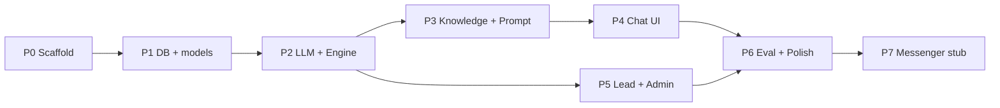

# Virtual Influencer Chatbot — Design & Implementation Plan

**Status:** Design validated (brainstorming lock)  
**Date:** 2026-08-12  
**Approach:** Modular monolith — Next.js (App Router) + MySQL

---

## 1. Understanding summary

- **What:** Prototype web chat (Messenger-like UI) where a Virtual Influencer (“car-savvy bestie”) discusses Hyundai Palisade and converts interest into test-drive leads (phone numbers).
- **Why:** Primary — conversation → test-drive lead. Secondary — prove VI + product knowledge + conversational AI + lead gen.
- **Who:** Internal / pitch demo first; architecture must not block a small consumer pilot later.
- **Constraints:** Next.js full-stack; LLM via provider abstraction (default OpenAI); curated swappable KB; MySQL; lead admin UI; notify hook stubbed.
- **Non-goals (v1):** Live Facebook Messenger webhook; vector RAG; Slack/email notify; sales/CS persona; large-scale infra (Redis/queue).
- **Success:** Meet all 7 demo criteria on the web prototype.

---

## 2. Assumptions

| ID | Assumption |
|----|------------|
| A1 | Conversation language is Vietnamese. |
| A2 | KB v1 content comes from `vi-chatbot-req.md` prices/specs; prices shown as “tham khảo”. |
| A3 | Context = last ~12 messages; no Redis required for v1. |
| A4 | Phone numbers are PII — stored in MySQL, shown in admin; avoid logging raw phones in production logs. |
| A5 | Demo hosting can be Vercel (or similar) + managed/local MySQL. |
| A6 | Single small team maintains one repo; no multi-tenant. |
| A7 | Persona is generic “car-savvy bestie” via system prompt (no separate brand bible yet). |

---

## 3. Decision log

| # | Decision | Alternatives considered | Why |
|---|----------|-------------------------|-----|
| 1 | Web prototype first; Messenger adapter later | Real Messenger day 1; web-only forever | Demo speed + clear upgrade path |
| 2 | No hard deadline — quality / architecture first | 1–3 week forced ship | Stakeholder choice |
| 3 | Full-stack Next.js (API routes + chat UI) | Python FastAPI; separate Express | One repo, fast prototype, TS end-to-end |
| 4 | LLM provider abstraction; default OpenAI | Lock single vendor | Swap cost/quality without rewrite |
| 5 | Leads: MySQL + admin UI; `notifyLead()` stub | Slack/email required v1; console-only | Criterion #7 without notify scope creep |
| 6 | Curated KB files (JSON/MD), content-swappable; no RAG v1 | Pinecone/Weaviate day 1; prompt-only blob | Accuracy + YAGNI; RAG if hallucination persists |
| 7 | Scale v1 = internal demo; path to small pilot | Scale-first infra | YAGNI |
| 8 | Persona = prompt-defined bestie | Named influencer brand pack | No assets yet |
| 9 | Architecture = modular monolith (Approach 1) | Prompt-only spike; RAG microservices | Best balance for demo + Messenger later |
| 10 | **MySQL** as primary database | Postgres / SQLite | Stakeholder requirement |

---

## 4. Final design

### 4.1 Architecture

```
[Web Chat UI] ──► POST /api/chat ──► ConversationEngine
                                           │
                     ┌─────────────────────┼─────────────────────┐
                     ▼                     ▼                     ▼
                  LLM Client          Knowledge loader        Lead service
                  (OpenAI…)           (MD/JSON inject)        MySQL + admin
                     │
                     └── channels/web (v1) → channels/messenger (later)
```

- **Channel adapters** normalize to `IncomingMessage` / `OutgoingMessage`.
- **ConversationEngine** owns orchestration only (no Facebook SDK inside).
- **LLM port** selected by env (`LLM_PROVIDER`, `OPENAI_API_KEY`, model name).
- **Messenger** route may exist as stub; not required for demo DoD.

### 4.2 Repo layout (target)

```
app/
  (chat)/page.tsx
  admin/leads/page.tsx
  api/chat/route.ts
  api/messenger/webhook/route.ts   # stub
lib/
  channels/{types,web,messenger}.ts
  conversation/{engine,session,intent}.ts
  knowledge/{loader.ts,palisade.json}
  llm/{types,openai,index}.ts
  leads/{service,notify}.ts
  db/{schema,client}.ts
prompts/{system.md,fewshots.md}
docs/vi-chatbot-design-and-plan.md
```

### 4.3 Data model (MySQL)

**sessions**  
`id`, `channel` (`web`|`messenger`), `channel_user_id`, `stage` (nullable), `created_at`, `updated_at`

**messages**  
`id`, `session_id`, `role` (`user`|`assistant`|`system`), `content`, `created_at`

**leads**  
`id`, `session_id`, `phone`, `summary`, `meta` (JSON: preferred model, etc.), `created_at`, `updated_at`

ORM: Drizzle or Prisma — pick one at scaffold (prefer **Drizzle** for lightweight TS). Unique-ish rule: one primary lead per session; new phone updates the same lead row in v1.

### 4.4 Conversation flow

Soft stages (prompt + optional `session.stage`):  
`discover` → `qualify` → `recommend` → `offer_testdrive` → `capture_phone` → `confirmed`

Per turn: persist user msg → load history + KB slice → LLM → extract VN phone → maybe create/update lead → persist assistant msg → return reply.

**Errors:** LLM failure → friendly fallback; DB down → 503; empty/too-long message → 400.

### 4.5 Knowledge & prompt

- `knowledge/palisade.json` (or MD sections): models, prices, engines, features, dimensions, lifestyle mappings.
- `prompts/system.md`: personality, rules (not sales/CS), flow toward test drive, “don’t invent specs outside KB”.
- Loader: keyword/tag slice injection (no embeddings v1).

### 4.6 Lead confirmation (criterion #7)

- `/admin/leads`: table of leads; detail = summary + recent messages.
- `notifyLead(lead)` exported hook — no-op v1; wire Slack/email later via env.

### 4.7 Testing & DoD

- Unit: phone extract, KB loader, web normalize.
- Integration: chat creates session/messages; phone creates lead; admin reads lead.
- Manual/scripted eval: 5–8 turn “Đà Lạt family” script against 7 criteria.

| # | Criterion | Done when |
|---|-----------|-----------|
| 1 | Messenger-like UI | Send/receive; session survives refresh |
| 2 | Influencer personality | Not Hyundai staff/CS in eval |
| 3 | Product knowledge | Answers match KB |
| 4 | Contextual memory | Recalls prior lifestyle |
| 5 | Need-based suggest | Recommends fitting trim/features |
| 6 | Lead conversion | Asks for phone on intent |
| 7 | Lead confirm | Visible on `/admin/leads` |

---

## 5. Implementation plan (detailed)

### Principles

- Ship vertical slices that always demo something.
- No Messenger production work until web DoD is green.
- No RAG until curated KB + prompt eval fails on accuracy.
- Keep diffs small; one runnable check per non-trivial module.

### Work breakdown & dependencies



---

### Phase 0 — Project scaffold (0.5–1 day)

**Goals:** Runnable Next.js app + env template + lint/test harness.

| Task | Deliverable |
|------|-------------|
| 0.1 | `create-next-app` (TS, App Router, ESLint) |
| 0.2 | Folder structure under `lib/`, `prompts/`, `docs/` |
| 0.3 | `.env.example`: `DATABASE_URL`, `LLM_PROVIDER`, `OPENAI_API_KEY`, `OPENAI_MODEL`, `ADMIN_SECRET` (simple gate for admin) |
| 0.4 | README: run locally (MySQL + `npm run dev`) |
| 0.5 | Optional: Vitest or node:test for unit checks |

**Exit:** `npm run dev` loads a placeholder page.

---

### Phase 1 — MySQL + schema (1 day)

**Goals:** Persistence ready.

| Task | Deliverable |
|------|-------------|
| 1.1 | Choose ORM (Drizzle recommended); connect MySQL |
| 1.2 | Migrations: `sessions`, `messages`, `leads` |
| 1.3 | `db/client.ts` singleton safe for Next.js |
| 1.4 | Smoke script: insert session + message |

**Exit:** Migration applies on empty MySQL; smoke script OK.

**Dependency:** Local or Docker MySQL (`mysql:8`).

---

### Phase 2 — LLM port + ConversationEngine skeleton (1–2 days)

**Goals:** API can reply with history (even with thin prompt).

| Task | Deliverable |
|------|-------------|
| 2.1 | `llm/types.ts` + `openai.ts` + factory |
| 2.2 | `session.ts`: create/load, append messages, last N |
| 2.3 | `engine.ts`: orchestrate turn (no KB yet / stub KB string) |
| 2.4 | `POST /api/chat` validate + call engine |
| 2.5 | Unit: message trim/validate |

**Exit:** curl/Postman: multi-turn replies with same `sessionId`.

---

### Phase 3 — Knowledge + system prompt (1–2 days)

**Goals:** Criteria #2–#5 foundation.

| Task | Deliverable |
|------|-------------|
| 3.1 | Author `knowledge/palisade.json` from req doc |
| 3.2 | `loader.ts`: full inject or keyword slice |
| 3.3 | `prompts/system.md` + optional few-shots |
| 3.4 | Wire loader into engine system message |
| 3.5 | Unit: loader returns expected slices for sample queries |

**Exit:** Scripted Qs (price Exclusive, ADAS list, seats) match KB.

---

### Phase 4 — Web chat UI (1–2 days)

**Goals:** Criterion #1.

| Task | Deliverable |
|------|-------------|
| 4.1 | Chat page: bubble list, input, send, loading state |
| 4.2 | Persist `sessionId` in localStorage |
| 4.3 | Messenger-like visual (not production Meta clone — clear demo UI) |
| 4.4 | Error/empty states |

**Exit:** Browser multi-turn works end-to-end.

---

### Phase 5 — Lead capture + admin (1–2 days)

**Goals:** Criteria #6–#7.

| Task | Deliverable |
|------|-------------|
| 5.1 | `intent.ts`: VN phone regex + helpers |
| 5.2 | `leads/service.ts`: create/update by session; list; get with messages |
| 5.3 | `notify.ts` no-op hook called after create |
| 5.4 | Prompt rules: when to ask for test drive + phone |
| 5.5 | `/admin/leads` list + detail (protect with simple secret/header or env password) |
| 5.6 | Integration test: phone in message → lead row |

**Exit:** Demo path captures phone; visible in admin.

---

### Phase 6 — Eval scripts + polish (1–2 days)

**Goals:** Demo confidence.

| Task | Deliverable |
|------|-------------|
| 6.1 | Markdown or JSON conversation scripts (family Đà Lạt flow + edge: phone first) |
| 6.2 | Manual checklist mapped to 7 criteria |
| 6.3 | Tone pass: remove salesy phrases from prompt if eval fails |
| 6.4 | Disclaimer in UI footer: demo / giá tham khảo / không phải CS Hyundai |
| 6.5 | Basic rate limit on `/api/chat` (per IP or session) for pilot-readiness |

**Exit:** Checklist signed off internally.

---

### Phase 7 — Messenger adapter stub (0.5–1 day, after web DoD)

**Goals:** Prove path without Meta dependency.

| Task | Deliverable |
|------|-------------|
| 7.1 | `channels/messenger.ts` normalize stubs + types |
| 7.2 | `api/messenger/webhook` verify challenge stub + TODO for Send API |
| 7.3 | Short `docs/messenger-next-steps.md`: Page, app, tokens, HTTPS |

**Exit:** Codepath documented; no broken web demo.

---

### Suggested sequencing calendar (flexible — no hard deadline)

| Week | Focus |
|------|--------|
| W1 | P0–P2 (scaffold, MySQL, engine API) |
| W2 | P3–P5 (KB, UI, leads/admin) |
| W3 | P6–P7 (eval, polish, Messenger stub) |

Buffer for prompt iteration and KB corrections after stakeholder review.

---

## 6. Risks & mitigations

| Risk | Impact | Mitigation |
|------|--------|------------|
| LLM invents specs/prices | Demo credibility | KB inject + “only use KB” rule + eval Qs |
| Tone sounds like sales bot | Criterion #2 fail | Few-shots + negative rules; eval checklist |
| Missed phone capture | Miss primary KPI | Regex post-process + prompt ask; integration test |
| MySQL / serverless connection limits | Prod flakiness | Connection pooling / serverless-friendly driver config |
| Scope creep (RAG, CRM, real Messenger) | Delay | Change control: only after v1 DoD |

---

## 7. Out of scope (explicit)

- Facebook Page / App Review / production webhook
- Pinecone/Weaviate/Chroma RAG
- Slack/email notifications (hook only)
- Full CRM sync
- Fine-tuned model
- Multi-language
- Analytics dashboards beyond lead list

---

## 8. Open items (non-blocking)

- Exact OpenAI model (`gpt-4o` vs `gpt-4o-mini`) — decide at P2 by cost/quality.
- Who signs off KB accuracy before external demo.
- Whether legal disclaimer copy is client-mandated.

---

## 9. Handoff

Design and plan are ready for implementation.

**Next step when approved:** Phase 0 scaffold in this repo, then Phase 1 MySQL schema.
